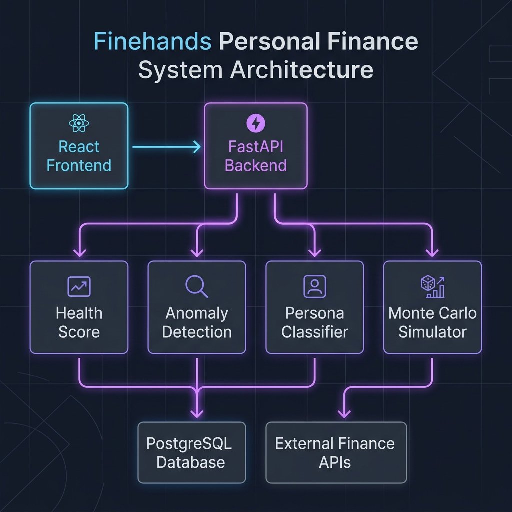
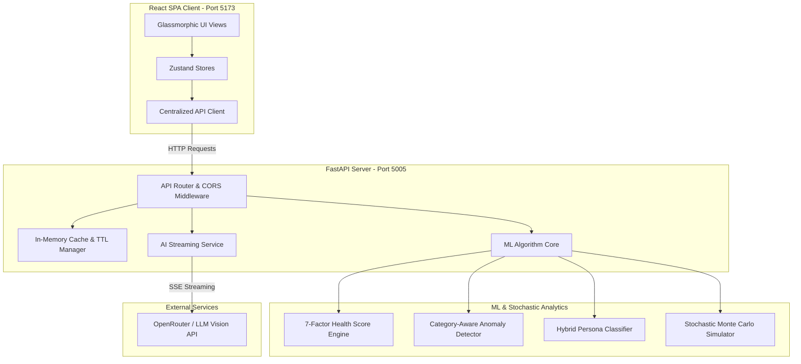
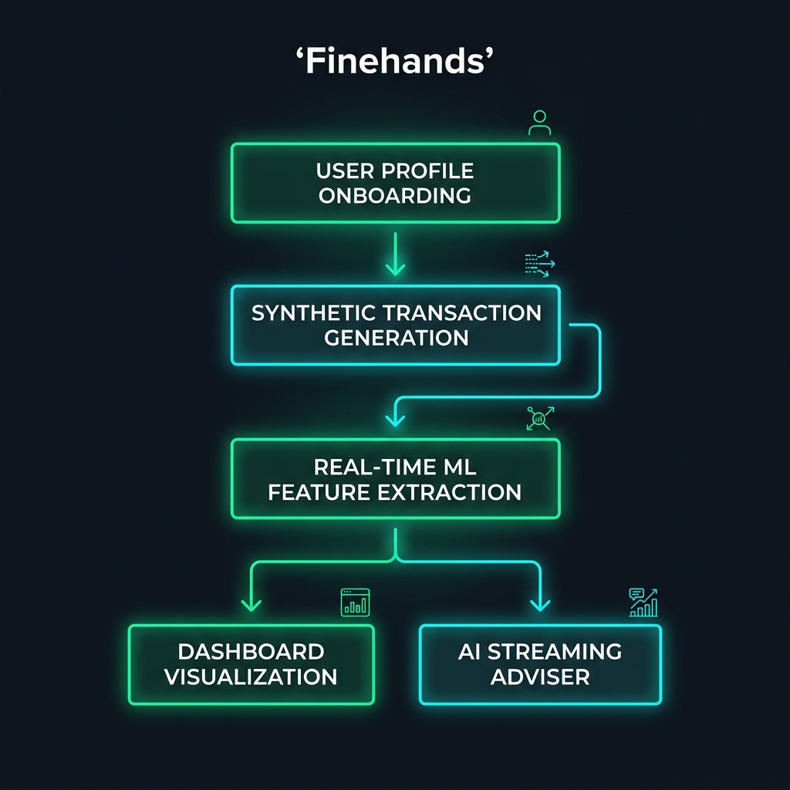
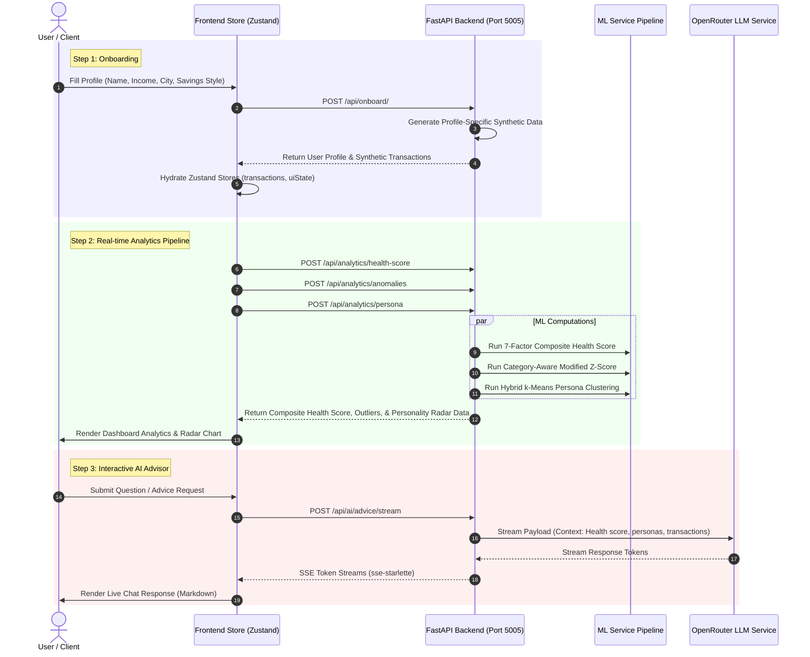

# 💸 Finehands — Intelligent Financial Health System

[](https://github.com/Mithunjagan/Fine-hands)
[](https://fastapi.tiangolo.com)
[](https://react.dev)
[](https://tailwindcss.com)

> **Finehands** is a hyper-intelligent, personal finance dashboard and analytics platform designed for developers and high-earning professionals. It transforms messy bank statements into high-fidelity actionable insights, offering real-time wealth prediction, category-aware outlier scan, dynamic spending archetypes, and an AI advisor.

---

## 🏛️ System Architecture

Finehands utilizes a split-microservice topology separating a high-performance **FastAPI** backend and a responsive **React 19 / TypeScript** Single Page Application (SPA), connected via standard RESTful APIs and real-time **Server-Sent Events (SSE)**.

### 📊 Architecture Visual Map


<details>
<summary>💻 View Mermaid.js Flowchart Code</summary>


</details>

---

## 🗺️ Logic Map & Data Flow

This diagram illustrates how data flows from onboarding, through statement parsing, state hydration, machine learning pipelines, and real-time advice generation:

### 📊 Logical Flowchart Visual Map


<details>
<summary>💻 View Mermaid.js Sequence Code</summary>


</details>

---

## 🔬 Core Algorithms & Academic Contributions

For final-year academic reviews or engineering deep-dives, Finehands introduces three novel algorithmic systems:

### 1. Temporal Trend-Weighted Health Score
Unlike static personal finance calculators that only evaluate current metrics, our composite health score weights 7 key variables using dynamic temporal decay:
$$\text{Health Score} = w_1 \cdot \text{Savings Rate} + w_2 \cdot \text{Emergency Fund} + w_3 \cdot \text{Sub Bloat} + w_4 \cdot \text{Consistency} + w_5 \cdot \text{Diversity} + w_6 \cdot \text{Anomaly Impact} + w_7 \cdot \text{Trend}$$
- **Trend Direction Weight (0.20)**: Uses the slope of an Exponentially-Weighted Moving Average (EWMA) of weekly spending to penalize worsening burn-rates.

### 2. Category-Aware Anomaly Scanner
Global thresholding fails on finance data (a ₹10,000 rent payment is normal; a ₹10,000 Starbucks bill is an anomaly).
- Computes **Modified Z-Scores** per spending category to remain robust against global volume outliers.
- Falls back to **Interquartile Range (IQR)** methods automatically when sample sizes are small ($N < 10$).

### 3. Stochastic Monte Carlo Wealth Simulator
Models future net worth over 6, 12, or 24 months through 500 stochastic trials factoring in:
- **Income Volatility**: Modeled via Normal Distribution $\mathcal{N}(\mu, \sigma^2)$ representing monthly variability.
- **Categorical Inflation**: 2% to 8% category-specific compounding expense inflation.
- Returns **Goal Hit Probability** and standard confidence bands ($P_{10}$, $P_{25}$, $P_{50}$, $P_{75}$, $P_{90}$).

---

## 🚀 Setting Up a Fresh Run

Follow these instructions to configure and execute a fresh environment of Finehands.

### 📋 Prerequisites
- **Python 3.10+** (verified on 3.10 and 3.11)
- **Node.js 18+** (verified on Node 20)
- **NPM** or **Yarn**

---

### 🐍 Step 1: Configure & Boot Backend (Port 5005)

1. **Navigate to the Backend Directory**:
   ```bash
   cd backend
   ```

2. **Create a Virtual Environment**:
   ```bash
   # On Windows (PowerShell/CMD):
   python -m venv venv
   .\venv\Scripts\activate

   # On macOS/Linux:
   python3 -m venv venv
   source venv/bin/activate
   ```

3. **Install Core Requirements**:
   ```bash
   pip install -r requirements.txt
   ```

4. **Setup Environment Variables**:
   Create a `.env` file inside the `backend/` folder (or copy `.env.example`):
   ```ini
   # OpenRouter API Key for real-time LLM Advisor
   OPENROUTER_API_KEY=your_api_key_here
   OPENROUTER_API_BASE=https://openrouter.ai/api/v1
   ```
   *Note: If no API key is specified, the application will automatically enter **Smart Offline Mode**, rendering realistic locally-mocked AI financial reports without throwing errors.*

5. **Start the FastAPI Server**:
   ```bash
   python app.py
   ```
   The backend will bootstrap on **[http://127.0.0.1:5005](http://127.0.0.1:5005)**. API Docs will be available at **[http://127.0.0.1:5005/docs](http://127.0.0.1:5005/docs)**.

---

### ⚛️ Step 2: Configure & Boot Frontend (Port 5173)

1. **Navigate to the Frontend Directory**:
   ```bash
   cd ../frontend
   ```

2. **Install Node Modules**:
   ```bash
   npm install
   ```

3. **Run the Development Server**:
   ```bash
   npm run dev
   ```
   The frontend UI will start on **[http://localhost:5173](http://localhost:5173)**.

---

### 🎮 Step 3: Conducting a "Fresh Run" Simulation

To demonstrate the full potential of Finehands during an evaluation, follow this structured demo path:

1. **Clean Slate / Onboarding**:
   - Open [http://localhost:5173](http://localhost:5173) in your browser.
   - If visiting for the first time, the **Onboarding Wizard** will launch.
   - Enter your name, select an Indian city (e.g., Bangalore for a high tech-hub multiplier), choose your spending profile (e.g., "Impulse Buyer"), and set your current savings.
   - Click "Complete Onboarding" to let the backend generate synthetic, profile-aligned transaction historical records.

2. **Dashboard Overview**:
   - Observe the **Financial Health Score** gauge (out of 100) along with its 7-factor breakdown sliders.
   - Scroll to see the **Spending DNA Radar Chart** showcasing your financial archetype.
   - Look at the **Spending Heatmap** showing calendar spending density.

3. **Run a Monte Carlo Wealth Simulation**:
   - Locate the simulator block.
   - Adjust the **Monthly Savings Slider** or **Goal Target** amount.
   - Observe the P10, P50, and P90 confidence curves calculating stochastic probability of hitting your target goal.

4. **Upload a Bank Statement (OCR Receipt Test)**:
   - Navigate to the receipt/transaction section.
   - Drag & drop a mock invoice or statement receipt image.
   - The scanner will animate, extract amounts/categories, and prompt you to import the transaction into your ledger.

5. **Engage the Money Doctor (AI Advisor)**:
   - Scroll to the bottom AI Advisor chat window.
   - Enter a query like: *"Should I buy an ergonomic mechanical keyboard?"* or *"Analyze my subscription bloat."*
   - Observe real-time streaming answers customized directly to the synthetic financial data generated in Step 1.

---

## 🛠️ Technology Stack

- **Backend**: FastAPI • Uvicorn • NumPy • SSE Starlette • PyPDF • HTTPX
- **Frontend**: React 19 • TypeScript • Vite • Zustand (State persistence) • Recharts (Radar, Heatmaps, Line) • Tailwind CSS v4 • Lucide Icons
- **Deployment & Sandbox**: PWA Progressive Web App support (Offline caching & mobile-ready manifest)

---

## 🤝 Contribution & Links
- **Repository**: [https://github.com/Mithunjagan/Fine-hands](https://github.com/Mithunjagan/Fine-hands)
- **License**: MIT License

---

*Last Updated: June 2026*
