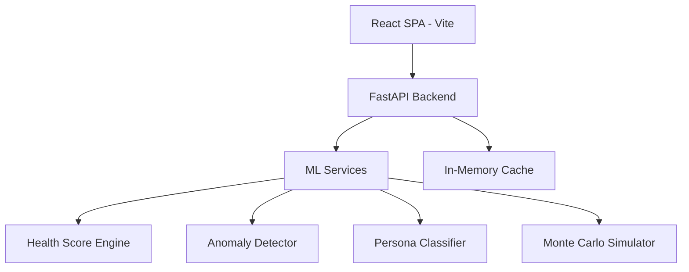

# System Architecture

## Overview
Finehands is an intelligent financial health system featuring a FastAPI backend and a React/Vite frontend. It uses advanced machine learning for anomaly detection, persona classification, stochastic Monte Carlo simulations, and a multi-dimensional health scoring model.

## High-Level Architecture

## Novel Contribution
The primary novel contribution of this system lies within the **Temporal trend-weighted composite scoring** mechanism of the Health Score algorithm, which penalizes worsening financial trajectories more heavily than static overspending, providing a dynamic and predictive measure of financial resilience.

## Data Flow
- **Onboarding:** Synthetic profiles generated based on city multipliers and spending style.
- **Transactions:** Categorization, OCR capabilities (fallback to mock data).
- **Analytics:** Data is processed in real-time by the ML pipeline to yield a unified health score, z-score anomalies, and cluster-based personas.
